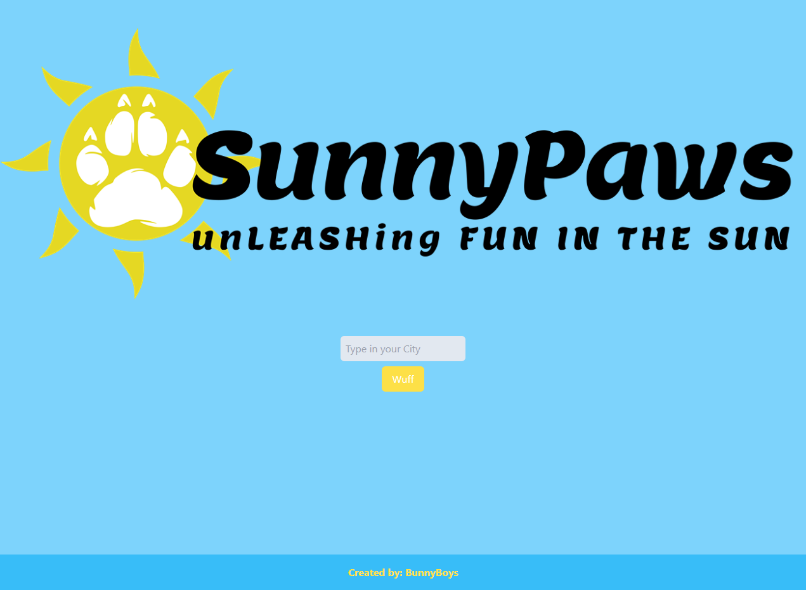
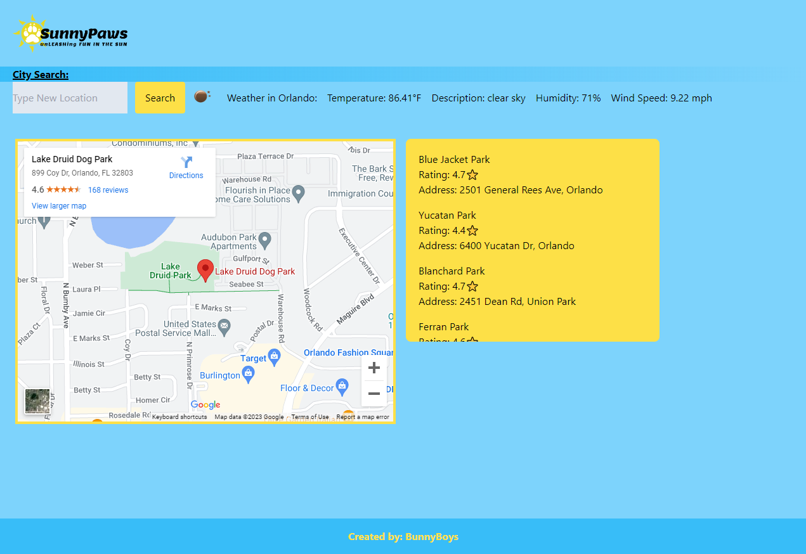

# SunnyPaws 

## Description

Fetch the perfect bark in the park, rain or shine! This app aims to find the nearest dog parks while showing the weather to plan the best, paw-tastic day with your fur-iend.

## Usage

Our website was designed to create the best way to find the local weather in the area as well as parks to take your furry friend. On the homepage, you will be greeted with our logo and an input to type in your location. From there, the site will direct you to the next page which will display the current weather as well as a map with locations for each park in the area.

## Credits

Felix Rivera: https://github.com/StygianTanuki 
Justin Moore: https://github.com/justinryan8828
Isaiah Rodriguez: https://github.com/IsaiahR533

## Screenshots

## Links

Repository: https://github.com/StygianTanuki/SunnyPaws
Website: https://stygiantanuki.github.io/SunnyPaws/